# FA22: CMPE-281 Sec 48 - Cloud Technologies Project 2

University Name: **[San Jose State University](http://www.sjsu.edu)**

Course: [Cloud Technologies](https://catalog.sjsu.edu/preview_course_nopop.php?catoid=12&coid=58375)

Professor: Sanjay Garje [Linkedin](https://www.linkedin.com/in/sanjaygarje)

## 1. Students

Nihal Kaul [Linkedin](https://www.linkedin.com/in/nihalwashere)

Utsav Rawat [Linkedin](https://www.linkedin.com/in/utsav-rawat-a519aa131)

Jaya Krishna Thupili [Linkedin](https://www.linkedin.com/in/thupili)

## 2. Project Introduction

Kitee helps you to create forms and surveys in under 2 mins that people would like answering.

Kitee is a web application where a user can sign up and quickly start creating their first form, publish it to the world with a shareable public link and collect responses on the fly. Everything built into a single platform, Kitee acts as your control center for creating forms without writing a single line of code.

Kitee is a SaaS (Software as a Service) offering where customers can buy subscriptions and will be billed on a metered basis, for example - $19/month to publish up to 3 forms with a maximum of 100 responses each.

## 3. Prerequisites

- Cloud Provider & Services: [AWS](https://aws.amazon.com/free/)
- Database: [MongoDB Atlas](https://www.mongodb.com/atlas/database)
- Version Control: [Github Developer access](github.com/)
- AWS Services
  - IAM
  - S3 Bucket
  - Certificate Manager
  - Route 53
  - CloudFront
  - CodePipeline
  - Elastic Beanstack
  - SNS
  - CloudWatch
  - SES

## 4. Local setup ad Configuration

1. **Tools**

   - Visual Studio Code
   - Node

   ```bash
   $ node --version
   v16.13.2
   $ npm -version
   8.1.2
   ```

   - Chrome with React Developer tools extension
   - something else?

2. **Setup**

   - Git clone the repo
   - Install dependencies
   - Start the app
   - Open [http://localhost:3000](http://localhost:3000) to view it in your browser.

   ```bash
   git clone https://github.com/4musks/kitee-app.git
   cd kite-app
   npm install
   npm start
   ## After compiling and starting successfully.. O/P:
       Compiled successfully!

       You can now view kitee-app in the browser.

       Local:            http://localhost:3000
       On Your Network:  http://192.168.56.1:3000

       Note that the development build is not optimized.
       To create a production build, use npm run build.

       webpack compiled successfully
   ```

## 5. Demo Screenshots

**_Page Navigation_**

1.  Signup and login using a valid email
2.  Validate email to receive notifications
3.  Create your first feedback form
4.  Build your form using questions, statements, choices and date fields
5.  Publish the form and share the url with participants
6.  Receive instant email alert via email for each response.
7.  Monitor the responses and insights
8.  Further integrations (coming soon)

    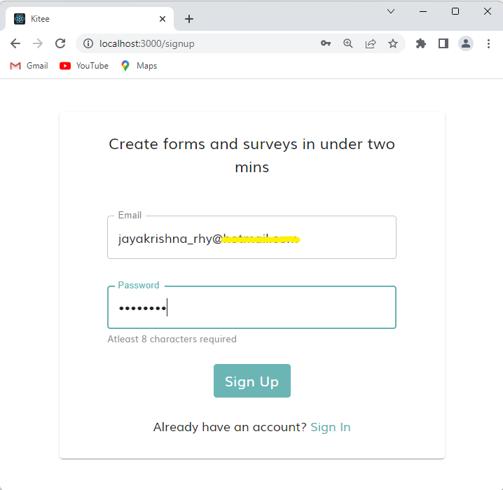
    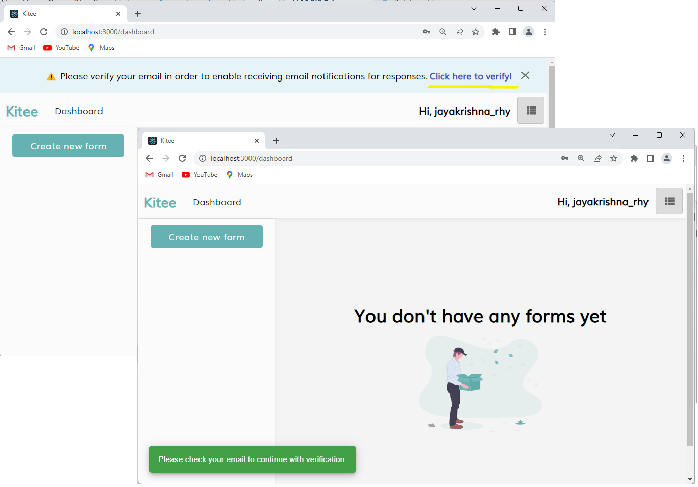
    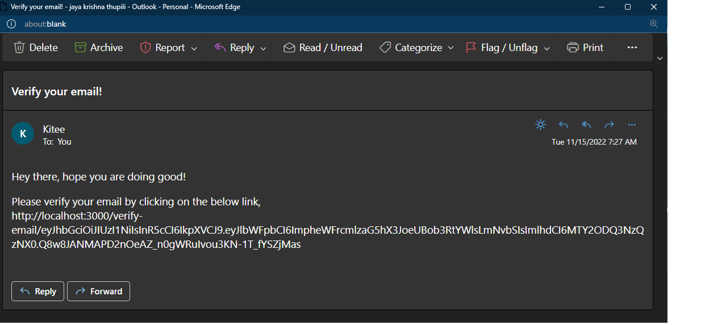
    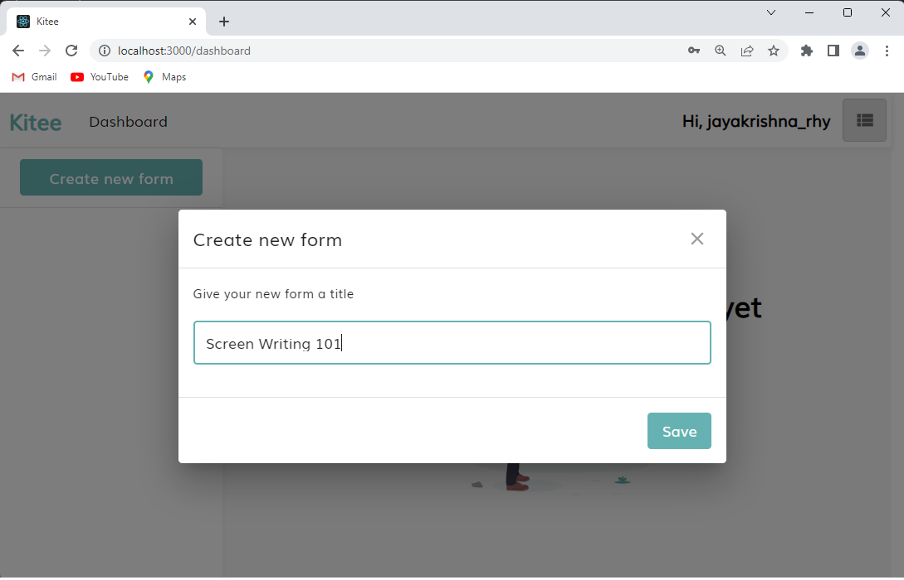
    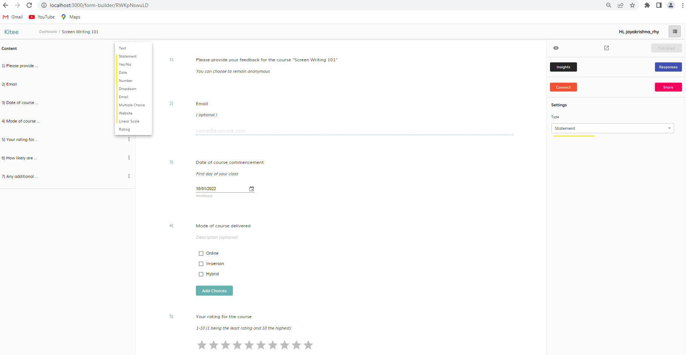
    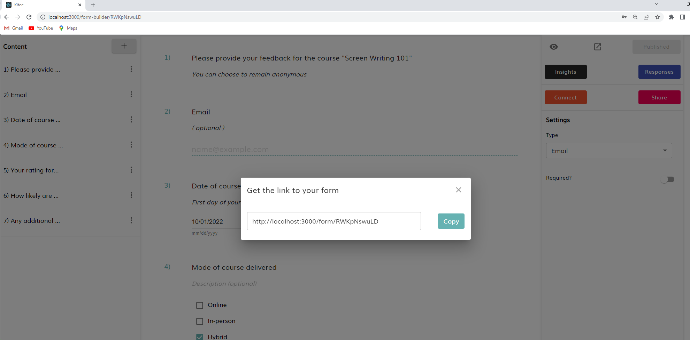
    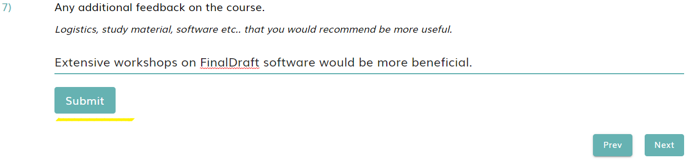
    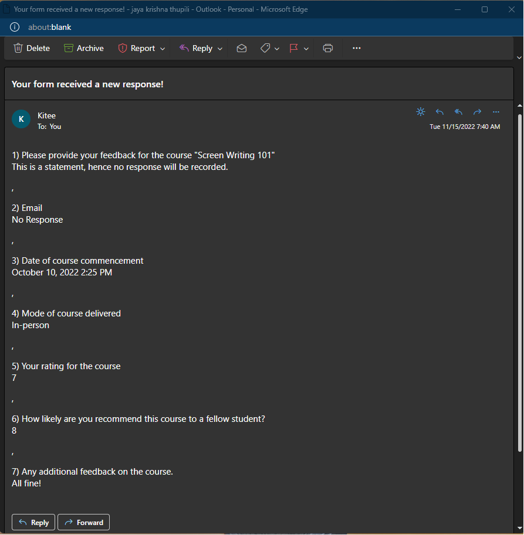
    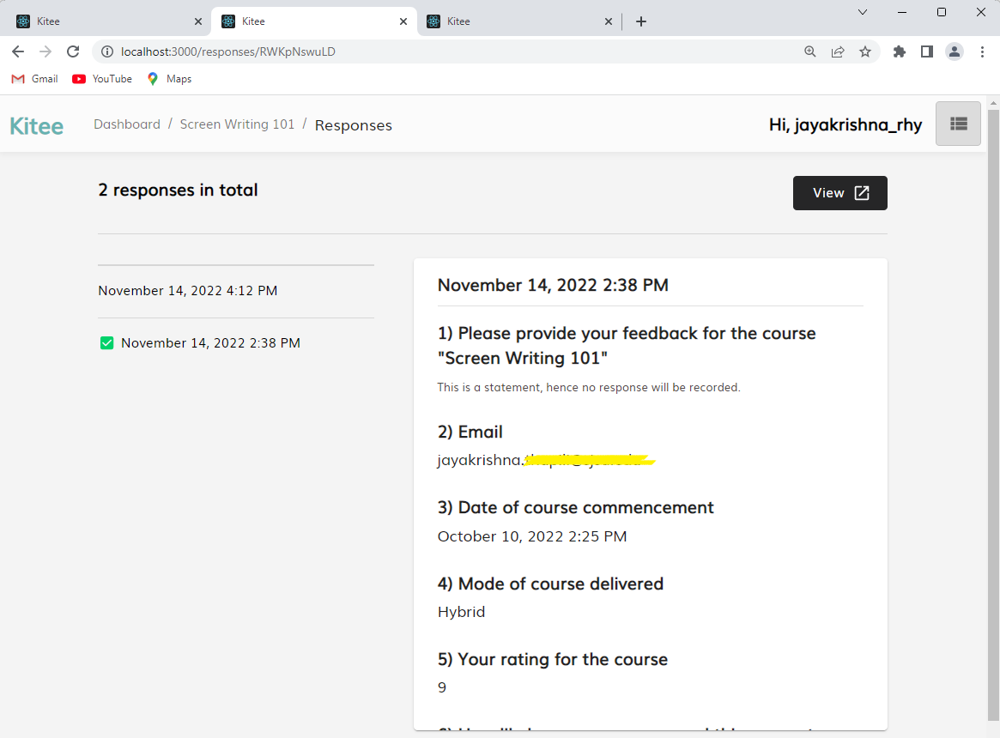
    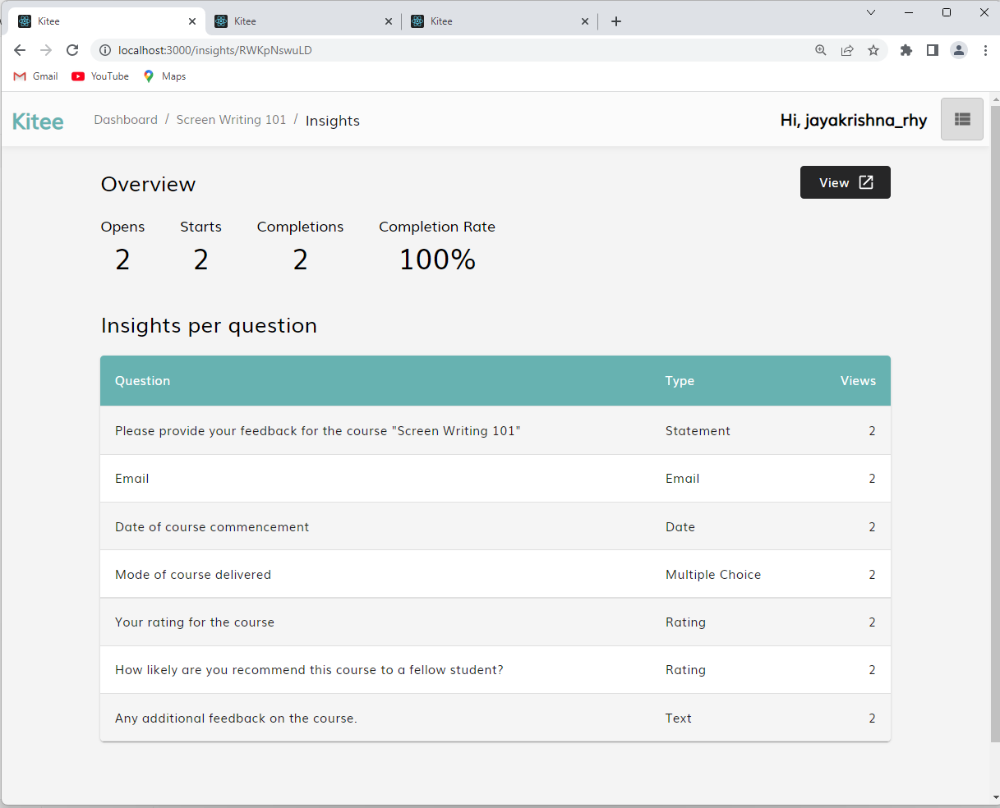
    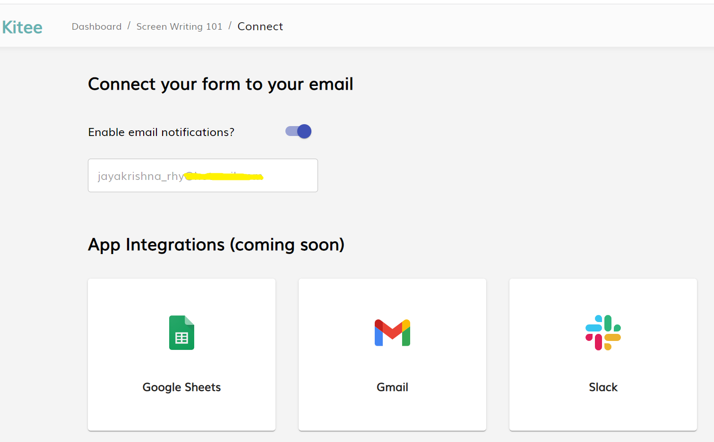

